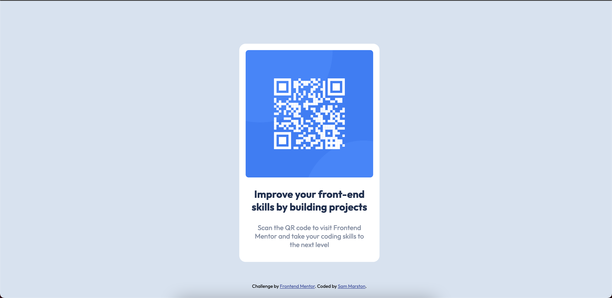

# Frontend Mentor - QR code component solution

This is a solution to the [QR code component challenge on Frontend Mentor](https://www.frontendmentor.io/challenges/qr-code-component-iux_sIO_H). Frontend Mentor challenges help you improve your coding skills by building realistic projects. 

## Table of contents

- [Overview](#overview)
  - [Screenshot](#screenshot)
  - [Links](#links)
  - [Built with](#built-with)
  - [Author](#author)

## Overview

### Screenshot

### Links

- Solution URL: [https://www.frontendmentor.io/solutions/sams-qr-code-component-solution-SgbqByKoC](https://www.frontendmentor.io/solutions/sams-qr-code-component-solution-SgbqByKoC)
- Live Site URL: [https://sammarston-qr-code-component.netlify.app/](https://sammarston-qr-code-component.netlify.app/)

### Built with

- Semantic HTML5 markup
- CSS custom properties
- Flexbox
- Mobile-first workflow

### Author

- Website - [https://sammarston-qr-code-component.netlify.app/](https://sammarston-qr-code-component.netlify.app/)
- Frontend Mentor - [@sammarston15](https://www.frontendmentor.io/profile/sammarston15)

